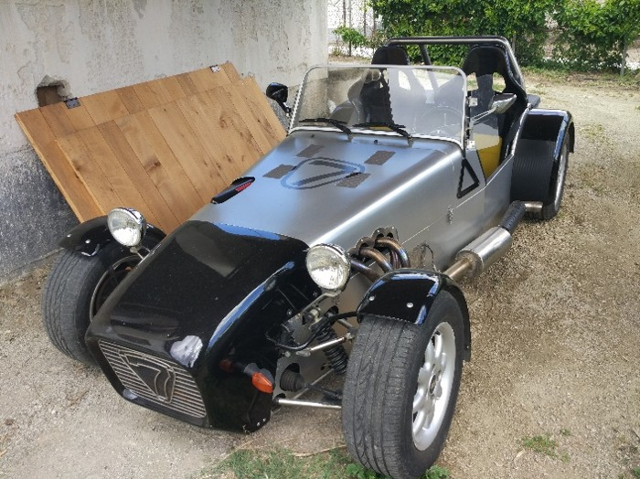
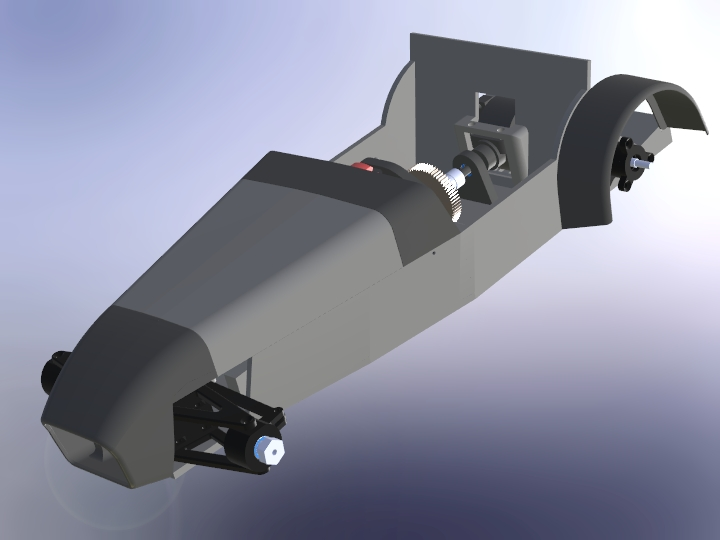

# 🏎️ 1:8 Scale 3D-Printed RC Lotus Super 7 Replica (V1)

Welcome to the repository for my custom, budget-friendly 1:8 scale RC Lotus Super 7. This project combines my passion for automotive engineering, CAD design, and embedded electronics (ESP32).

The core philosophy behind Version 1 was **maximum cost-efficiency without sacrificing driving dynamics**. 

---

## 📸 Media & Gallery
*Check out the repository folders above to see photos of the real full-scale Lotus 7 built with my father, as well as the FE/multibody simulation files used to study the chassis rigidity!*

---

## 🛠️ Project Highlights & Engineering Decisions

* **The Brains (ESP32 & ESP-NOW):** Bypassed expensive proprietary RC transmitters. Instead, I performed "surgery" on a cheap toy remote, replaced its mainboard with an **ESP32**, and wired it directly to the original potentiometers. It communicates with a receiver ESP32 on the car via **ESP-NOW** for lightning-fast response times.
* **The Power (Custom 18650 Pack):** Avoided pricey Li-Po batteries by utilizing high-drain 18650 cells. I designed a custom heavy-duty battery holder using press-fitted copper tabs and solid rear-soldered wiring. 
* **The Chassis & Drivetrain:** To keep V1 ultra-budget, physical suspension springs were skipped (planned for V2). However, to avoid an undriveable solid rear axle, a budget RC gear differential was integrated into the 3D-printed rear housing. 

---

## 🚀 Status: Upcoming Releases

This project is actively being documented. I will soon be uploading:

- [ ] **CAD Files:** Full `.STEP` and `.STL` files for the 3D-printed chassis, custom battery holder, and body panels.
- [ ] **Firmware:** The complete ESP32 transmitter and receiver source code (C++/Arduino IDE) utilizing ESP-NOW.
- [ ] **BOM (Bill of Materials):** A checklist of the cheap electronics and hardware components used.

**Stay tuned! Star the repository to get notified when the source files drop.** 🌟

---

## 🔮 Future Roadmap (V2)
- [ ] Implement full spring suspension geometry.
- [ ] Optimize the remote by housing a permanent 18650 cell inside with an integrated TP4056 charging circuit.
- [ ] Iterate the chassis design based on insights gained from the multibody simulation.

